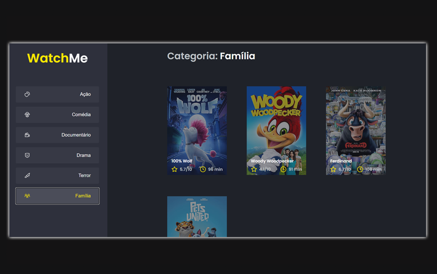

[](https://portfolio-nadi.vercel.app/)
[](https://twitter.com/nadiduno)
[](https://www.linkedin.com/in/nadiduno/)

<div align="center">
  
  <br />
</div>

listMovies: Frontend de uma listagem de Filmes apresentados por categorias.

<br/>
[ReactJS](https://reactjs.org/) | [Node.js](https://nodejs.org/en/download/) | [Yarn](https://yarnpkg.com/)


```bash
# Install the dependencies
$ yarn

# Run the developer
$ yarn dev

# Run the server
$ yarn server
```
Challenge 2: Modulo de ReactJS da 🚀 [Rocketseat](https://www.rocketseat.com.br/) © 2022